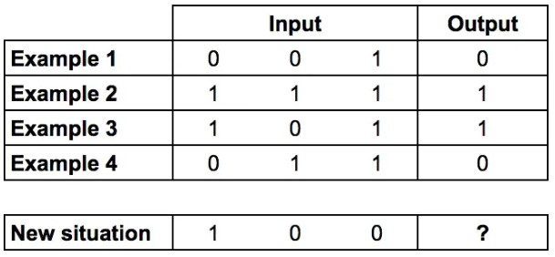
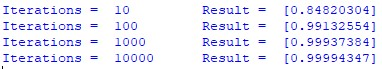
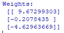
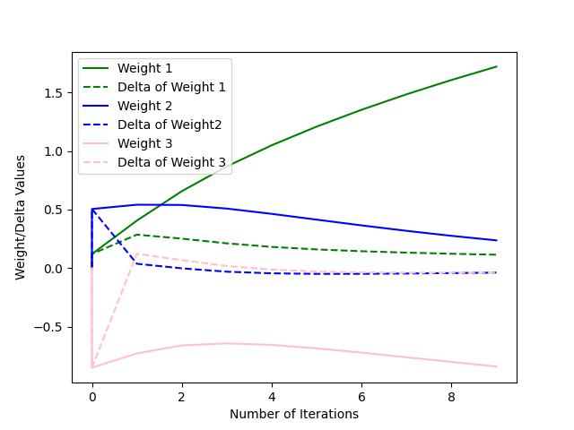
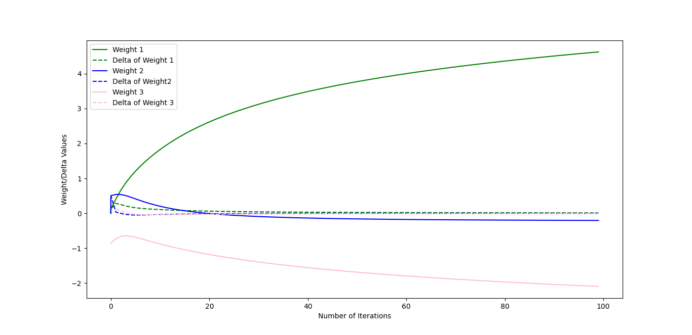
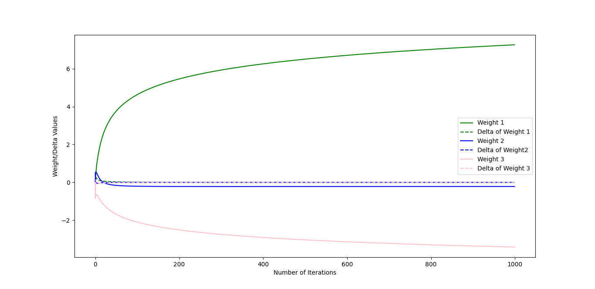
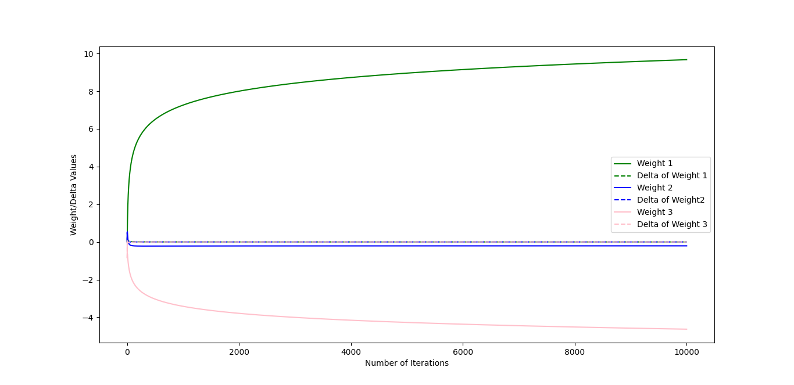

# simple-neural-network
A simple neural network without the use of any neural network library.

#### To learn the basics of neural networks, I first started with a simple example found in the blog below. 

https://medium.com/technology-invention-and-more/how-to-build-a-simple-neural-network-in-9-lines-of-python-code-cc8f23647ca1

#### The example from this blog uses a small training set of ones and zeros (see below screenshot of data from blog post). 

## Training

#### The pattern on this training set is that if the first feature is one, then the output is one. Likewise, if the first feature is zero, then the output is zero. 

#### In this example, each feature will be adjusted by a weight, then passed through the sigmoid function. The larger the weight (positive or negative), the larger the impact of that feature on the output. In this case, since the output is determined by the first feature, the expected outcome is that the weight for the first feature will have a large value. 

#### The training process is to complete the above calculations and compare it to the expected output. The resulting comparison will be used to adjust the weights being applied to each feature, then this process is repeated many times until the values of the weights reach their steady state values.

## Results

#### I compared the results of this algorithm with 10, 100, 1000, and 10000 iterations. The expected output was one, and the results can be seen below, where as the the number of iterations increased, the closer to the correct output.

#### The final values of the weights with 10000 iterations is seen below. As expected, the value of the first weight is the highest value as the first feature has the largest impact on the output. 

#### I also plotted how the value of each weight changed with each iteration, as well as the delta between the weights. The below graphs show the results after 10, 100, 1000, and 10000 iterations. 

### 10 Iterations

### 100 Iterations

### 1000 Iterations

### 10000 Iterations 

